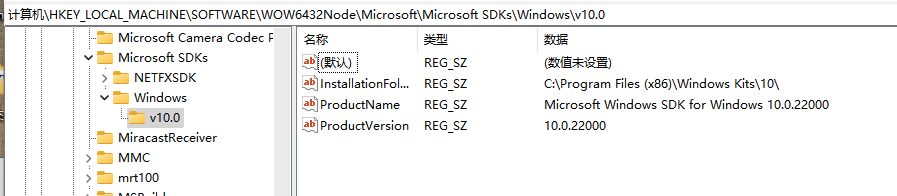

( ... 新年快乐)

#### 一、WindowsSDK未找到 (实际SDK已经安装)

**报错信息如下**

```
npm ERR! C:\Program Files\Microsoft Visual Studio\2022\Community\MSBuild\Microsoft\VC\v170\Microsoft.Cpp.WindowsSDK.targets(46,5): error MSB8036: 找不到 Windows SDK 版本 10.0.22000.0。请安装所需版本的 Windows SDK，或者在项目属性页中或通过右键单击解决方案并选择“重定解决方案目标”来更改 SDK 版本。
```

如上所示，本地WindowsSDK已安装，在编译时报错`MSB8036`，即找不到SDK。

**可能原因**

本地有过多个版本的VS，且手动安装VS的时候，修改了默认的路径，导致当前版本VS在使用时，在默认目录下找不到已安装的SDK。

**解决办法**

**1、找到配置文件`UAP.props`**

```shell
# 目录地址
[SDK目录]\DesignTime\CommonConfiguration\Neutral\UAP\10.0.22000.0\UAP.props
```

SDK目录找不到情况下，可以在文件管理器中搜索文件夹名称 `Windows Kits`

**2、修改MSBUILD相关配置内容如下**

```xml
<!-- 原始配置 <WindowsSdkDir>$([MSBUILD]::GetDirectoryNameOfFileAbove('$(MSBUILDTHISFILEDIRECTORY)', 'sdkmanifest.xml'))\</WindowsSdkDir>
 -->
<WindowsSdkDir Condition="'$(WindowsSdkDir)' == ''">$([MSBUILD]::GetDirectoryNameOfFileAbove('$(MSBUILDTHISFILEDIRECTORY)', 'sdkmanifest.xml'))\</WindowsSdkDir>
```

重启VS，或者重启电脑

**3、如果修改后，任然报错`MSB8036`**

检查注册表

```shell
计算机\HKEY_LOCAL_MACHINE\SOFTWARE\WOW6432Node\Microsoft\Microsoft SDKs\Windows\v10.0
```

比对信息是否有缺失




#### 二、`node-gyp`重新编译失败

**报错信息如下**

```text
npm ERR! code 1
npm ERR! path ****\node_modules\better-clipboard
npm ERR! command failed
npm ERR! command C:\WINDOWS\system32\cmd.exe /d /s /c node-gyp rebuild --release
npm ERR! 在此解决方案中一次生成一个项目。若要启用并行生成，请添加“-m”开关。
npm ERR!   main.cc
npm ERR! C:\Users\hellodlyn\AppData\Local\node-gyp\Cache\16.15.0\include\node\node.h(63,10): fatal  error C1083: 无法打开包 括文件: “v8.h”: No such file or directory ****\node_modules\better-clipboard\build\better_clipboard.vcxproj]
npm ERR! gyp info it worked if it ends with ok
npm ERR! gyp info using node-gyp@8.4.1
npm ERR! gyp info using node@16.15.0 | win32 | x64
npm ERR! gyp info find Python using Python version 3.11.1 found at "D:\Software\Python3\python3.exe"
npm ERR! gyp info find VS using VS2022 (17.4.33213.308) found at:
npm ERR! gyp info find VS "C:\Program Files\Microsoft Visual Studio\2022\Community"
npm ERR! gyp info find VS run with --verbose for detailed information
npm ERR! gyp info spawn D:\Software\Python3\python3.exe
```

如上所示，`better-clipboard`需要重新编译，编译时候，显示如上信息，此处`better_clipboard.vcxproj`在项目里存在，但任然报错。此处需要

**移除目录`C:\Users\hellodlyn\AppData\Local\node-gyp`后，重新install，即重新安装`node-gyp`**

**PS：**node-gpy目录可能在 ` $HOME/.node-gpy` 下


#### 三、编译时指定Python版本

1、修改npm配置

```shell
npm config set python "D:\Software\Python27\python.exe" 
npm install
```

2、配置package.json

```shell
# 如Electron中
"ebuild:mac": "export PYTHON_PATH=python; vue-cli-service electron:build --mac",
```

